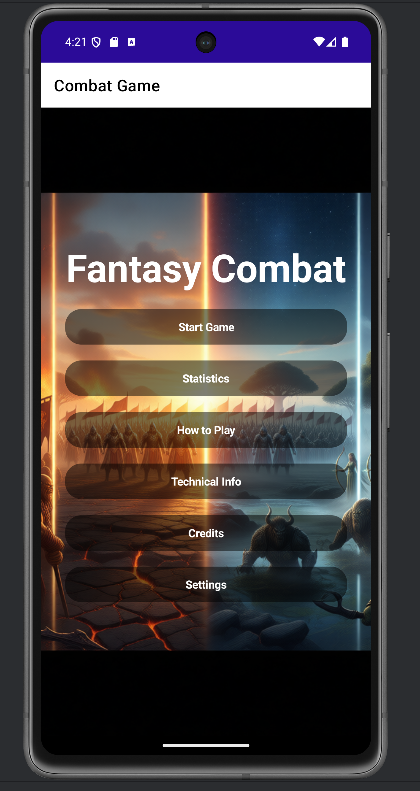
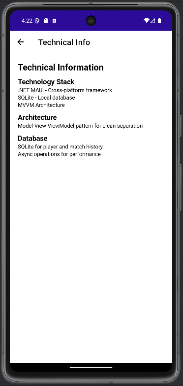
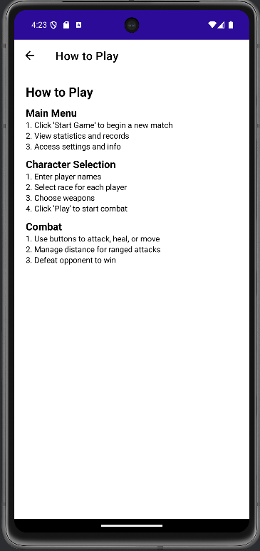

# ⚔️ Turn-Based Combat Game - Android

A fully functional turn-based fantasy combat game for Android built with .NET MAUI, featuring 4 unique fantasy races with distinct abilities, weapons, and combat mechanics.

## 📋 Table of Contents

- [Features](#features)
- [How to Build](#how-to-build)
- [How to Deploy](#how-to-deploy)
- [Screenshots](#screenshots)
- [Architecture Overview](#architecture-overview)
- [Database Schema](#database-schema)
- [Technical Design](#technical-design)
- [Credits](#credits)

## ✨ Features

- **4 Fantasy Races**: Human, Elf, Orc, Beast.
- **Turn-Based Combat**: Strategic gameplay with a distance mechanic.
- **Local Data Persistence**: SQLite database for player profiles and match history.
- **Dedicated Pages**: Separate pages for How to Play, Technical Info, and Credits.
- **Placeholder Images**: Character images are displayed for each turn.

## 🚀 How to Build

1. **Clone the repository**:
   ```bash
   https://github.com/AlejandroXV5/PROYECTOAPP2.git
   
   ```
2. **Restore dependencies**:
   ```bash
   dotnet restore
   ```
3. **Build the project**:
   ```bash
   dotnet build -f:net9.0-android
   ```

## 🚀 How to Deploy

1. **Publish the app**:
   ```bash
   dotnet publish -f:net9.0-android -c:Release
   ```
2. **Find the APK**: The generated APK can be found in `bin/Release/net9.0-android/publish/`.
3. **Install on a device**:
   ```bash
   adb install com.companyname.GAME-Signed.apk
   ```

## 📸 Screenshots





## 🏗️ Architecture Overview

The application follows the MVVM (Model-View-ViewModel) design pattern.

- **Models**: Contain the data and business logic of the application.
- **Views**: The UI of the application, defined in XAML.
- **ViewModels**: Expose data from the models to the views and handle user interactions.
- **Services**: Provide services to the application, such as database access.

## 🗄️ Database Schema

### Players
- `Id` (INTEGER, PRIMARY KEY)
- `Name` (TEXT, UNIQUE)
- `TotalWins` (INTEGER)
- `TotalLosses` (INTEGER)
- `TotalDraws` (INTEGER)
- `GamesPlayed` (INTEGER)

### MatchHistory
- `Id` (INTEGER, PRIMARY KEY)
- `Player1Name` (TEXT)
- `Player2Name` (TEXT)
- `WinnerName` (TEXT)
- `ResultType` (TEXT)
- `Player1FinalHealth` (INTEGER)
- `Player2FinalHealth` (INTEGER)
- `TurnsPlayed` (INTEGER)
- `PlayedAt` (DATETIME)

## 🔧 Technical Design

For a detailed explanation of the game rules and technical implementation, please see the [TECHNICAL_DESIGN.md](docs/TECHNICAL_DESIGN.md) file.

## 🙏 Credits

- **Developed by**: Alejandro Bolaños Chinchilla
- **Technologies used**: C#, .NET MAUI, SQLite
